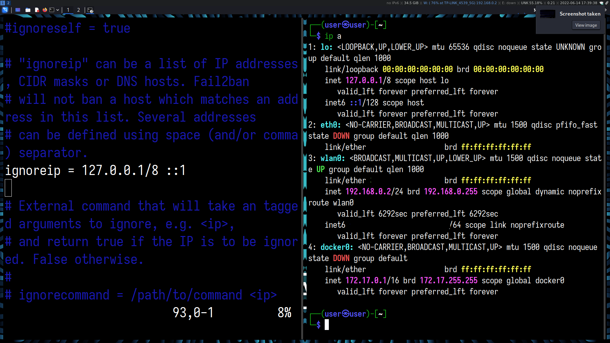
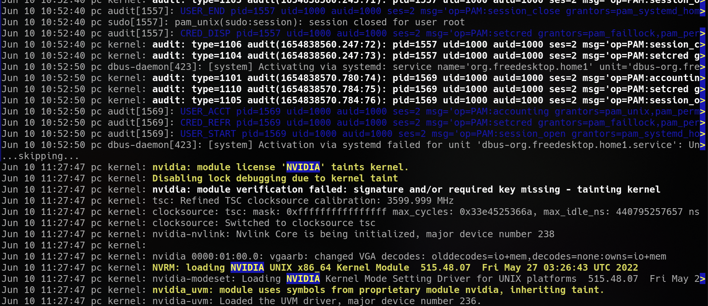

# System and Network Hardening

Reducing the attack surface of the network and the systems on the network. Most of the time, addressing vulnerabilities one at a time is much less productive than straight up reducing the attack surface of the system/network. It is seriously effective at reducing vulnerabilities , while keeping your network and systems organized, documented, and accounted for.

## This entire process was followed in accordance with the relevant [CIS Benchmarks](https://www.cisecurity.org/cis-benchmarks/)

---

## Enumerating Devices on the local network-

A preliminary scan to check whether your network has already been compromised. You can do that by...

Running either a [network scan]() or by simply logging into the router's internal webserver, we can see a list of hostnames, MAC addresses and IP addresses of devices on the network.


## Securing network devices


### DoS/DDoS prevention

First, change the administrator login to the portal(I _know_ you haven't changed it...)

If WLAN is enabled, **ensure** you're using at least WPA2 or WPA3 (personal mode assumed

**[Do not use WEP](https://en.wikipedia.org/wiki/Wired_Equivalent_Privacy#Weak_security)**

**Disable WPS**!!

**Change your SSID**!!

**Disable SSID broadcast**!!

**Disable guest networks**

Set up your DHCP server if deemed necessary, and if you want to be extra cautious, meddle with the power settings and even experiment with different WiFi bands if you experience interference(textbook Denial of Service) because of microwaves or other devices operating.

Explicitly assign IP addresses to all known devices(by MAC), one by one. Do this in two steps-

1. Reserving IP addresses for certain MAC addresses.Use the notes field if available to give a short description for each device.
   

2. Enable MAC filtering, and add the same MAC addresse. These reserved addresses ensure that you can run services over the local network without any confusion because of a sudden change in IP address allocation

Create a network topology map documenting the routers

From now on, you may assume all devices on the local network are trusted by default. If in doubt, remember your schema and check the enumerated network for an IP address that does not match your pattern.

## Updates

Make sure you are running the latest supported version of the operating system, and that all applications/packages are up-to-date.


Check for BIOS/UEFI firmware upgrades from the manufacturer(including mobile phones)

Do not forget to check for updates for applications with their own updating mechanism.

**Ensure that security updates for all systems are enabled and preferably set to automatically check, fetch, and perform updates. Updates contain (often security)patches from the developers, which is why staying up-to-date is so important.**

Yes, Microsoft Windows too.


## Setting up Needed Services

### Setting up a File Server

Since the file share is only intended to be used over the local network, plain FTP(from `inetutils`) is being used, as opposed to FTP over TLS or SSH-FTP(SFTP)

Start the FTP server process with `ftpd [options]`. It uses TCP on the port you define. Along with **using a secure FTP implementation**(FTPS,SFTP), I highly recommend changing away from the **default ports** that your server uses. You'd also want to **disable anonymous and root login**.

Edit the `/etc/ftpusers` file to your liking, and your FTP server should be set up. Connect to this server with an appropriate client, or use functionality from file managers like _Thunar_, _Dolphin_, _Nautilus_, etc. to add the FTP share as a "folder" in sidebar.

### Setting up remote(local) administration/SSH

First, install the appropriate package that provides an SSH server like `openssh`

First, generate keys with

`ssh-keygen -t ed25519` (this algorithm in particular because +performance)

Then copy over your public key to the designated "remote" machine

`ssh-copy-id -i .ssh/id_ed25519.pub username@192.168.0.2`

Public Key Authentication is now set up! Try it by connecting to the machine with

`ssh username@address`

If you aim for remote administration, **change your default port**! Also, install an intrusion prevention service like `Fail2ban`.

#### Fail2Ban Installation and setup

_from their website-_

> Fail2ban scans log files (e.g. `/var/log/apache/error_log`) and bans IPs that show the malicious signs -- too many password failures, seeking for exploits, etc.

Setting up Fail2Ban to watch for multiple SSH login attempts(failures)- make a copy of the jail.conf configuration file and add IP addresses you want it to ignore. Consult the docs for additional configuration.




Open up the required ports with your firewall(here, ufw)

`sudo ufw allow ssh` (RTFM)

### Passwordless authentication, SSHd configuration

Explicitly set `PasswordAuthentication no` in the SSH server configuration to allow only Public Key Authentication.

Review the available options(X11 forwarding, TCP forwarding, etc.) in the configuration file

Enable the corresponding sshd service unit file to automatically start the daemon upon startup.

Edit the configuration file at `/etc/ssh/sshd_config` to change port number, SFTP settings, etc.

<sub>Expose your services to the internet only after detective, preventive, and deterrent measures are put in place by setting up port-forwarding on your router.</sub>

###### _future_:VNC

## Firewall

> The firewall is the first line of defense for a system connected to the internet.

Upon setting up these services intended to be used on the local network only, remember to set rules on

1. your gateway/router(internal webserver will have a page for firewall rules)
2. server(here, the system running these SSH/FTP/VNC etc. daemons)
3. client(Microsoft Windows or Linux desktop PCs and laptop devices)

An additional step would be installing your preferred router firmware like `OpenWRT`.

For server or server-like systems running Unix-like OSes, `iptables`, `nftables`, or `ufw` are the first things you should look to. You should also install other IDS/IPS services that specializes in securing each target(be it your FTP,SSH,VNC,git,NFS server)

### Uncomplicated Firewall(for the GNU/Linux server and client)

from the ubuntu wiki-

> The Linux kernel in Ubuntu provides a packet filtering system called netfilter, and the traditional interface for manipulating netfilter are the iptables suite of commands.

> Becoming proficient in iptables takes time, and getting started with netfilter firewalling using only iptables can be a daunting task.

> The Uncomplicated Firewall (ufw) is a frontend for iptables and is particularly well-suited for host-based firewalls. ufw provides a framework for managing netfilter, as well as a command-line interface for manipulating the firewall

> ufw aims to provide an easy to use interface for people unfamiliar with firewall concepts, while at the same time simplifies complicated iptables commands to help an administrator who knows what he or she is doing.

If UFW does not come pre-installed on your system, install it using your package manager


Initial set-up should always go after these two rules are created (deny-by-default principle)

```
ufw default deny
ufw allow from <local network>
```

Enable UFW logging, and add the appropriate rules

Purge ridiculous "web search" apps from your system. These are likely adware+spyware. Just use your web browser and a bookmarked search engine

### For client systems-

**Android**-Not typically the target of web-based attacks, so less security is acceptable. However, use native android "permissions" to make each app abide by the [least privilege principle](https://www.cisa.gov/uscert/bsi/articles/knowledge/principles/least-privilege#:~:text=The%20Principle%20of%20Least%20Privilege%20states%20that%20a%20subject%20should,control%20the%20assignment%20of%20rights.) ...also talked about [here](#least-privilege).

You can also use native android functionality to deny installation of apk from storefronts/marktplaces not in a whitelist.

Some android spins allow you to deny network access to apps. This is as good as a firewall denying outgoing traffic from that app.

Firewalls are available which masquerade as a "VPN" to the OS, but these drain battery life, and are nowhere as efficient as uninstalling the app or just restricting permissions.

**Microsoft Windows**-Use a ""trusted""(""reputable"") antivirus solution, these typically have anti-malware, PUA, IDS/IPS, anti-keylogger, safe banking, botnet detection and firewall services built-in with reasonable defaults. Ensure protections are in place for unsafe hyperlinks and email attachments

For simpler setups(favouring advanced users), use the Firewall and Microsoft Defender that comes along with the OS.

**Linux**-Nowhere as prevalent as Windows, but you might have to be more careful with linux systems, as attacks crafted for linux machines are usually untargeted in nature and intended for small to large servers, not home PCs. Most commonly-botnets and worms

Firewalls you can use are already [mentioned above](#firewalluncomplicated-firewall), you can combine this with periodic scans with [`ClamAV`](https://wiki.archlinux.org/title/ClamAV) (antivirus for linux), along with keeping your system up to date.

## Least Privilege

**Disable the root account** on every system you can get your hands on. Instilling minimal permissions on regular user accounts can lessen the scope of an attack from threats outside your home network.

> Make sure `sudo` is set up before disabling the root account!

> Make sure you edit the `sudo` configuration with `$ visudo`!

Set up your filesystem with appropriate permissions

Audit groups and users, and make sure service accounts do not have unnecessary privileges

## Removing unnecessary applications and services

### Systemd

`systemctl` is your Bible here. Systemd manpages are _THE_ FM to R. Disable unnecessary startup services, and disable .services in favour of .sockets. Learning some basic systemd administration is essential in managing linux boxes.


### Removing unneeded applications

Uninstall software that you rarely use, even if it doesn't start up automatically

#### On Debian/Ubuntu systems,

To show packages marked as manually(explicitly) installed. These packages are not autoremovable.

`apt-mark showmanual | less`

To set packages as auto or manual refer to the manual:

`man apt-mark`

To remove orphan packages:

`sudo apt -y --purge autoremove`

Uninstall software that litters trackers all over your system in favour of FOSS software.

Remove VPN "apps", replace them with OpenVPN+configuration files. Remove proprietary "apps" like WhatsApp, Telegram and use the browser version. Or even better, use FOSS alternatives.


Remove google chrome, install librewolf. Install uBlock Origin [Hard Mode, Do You Dare?](https://github.com/gorhill/uBlock/wiki/Blocking-mode:-hard-mode)

Start off with a user.js from [Arkenfox](https://github.com/arkenfox/user.js/) or [this one if you like to live dangerously](https://github.com/pyllyukko/user.js/)

## Logging

Install `auditd` to log acces to files you specify.

```
auditd/jammy 1:3.0.7-1build1 amd64
  User space tools for security auditing
```

### Syslog

If deemed necessary, set up syslog-ng or rsyslog. Most users do not need this as [Journalctl](#systemd-journald)

```
rsyslog/jammy-security,jammy-updates,now 8.2112.0-2ubuntu2.2 amd64 [installed]
  reliable system and kernel logging daemon
```

### Systemd-journald

Also, learn basic systemd/journald usage, and cleaning-rotating operations. Experiment with viewing logs for different boots, looking at boot messages, application logs, logs for specific units





It is easy to script graphical popups/alerts on an event too.

> There is no point collecting logs if you're never going to read them

## Encryption

discussed in further detail [Here](encryption.md)

## Physical Security

Use full disk encryption if you have valuable or sensitive information. Any devices taken out of the house must be visited individually and checked to see if any banking information, credit card numbers, etc. are unsecured.

> Remember, your stolen 10k phone can have enough photographs of you, your signature, and your banking habits/information to successfully impersonate you.

Ensure any mobile payment apps have an "app-lock" on them at the very least. Enable `remote wipe`, and `FindMyPhone` features if available.

Make sure your network and electrical wiring is not exposed outside the house, [juicy target for rodents and neighbourhood kids](https://slate.com/technology/2014/08/shark-attacks-threaten-google-s-undersea-internet-cables-video.html), and of course, the elements.

## TOR setup

---

## [Backup and Recovery in case of data loss and ransomware](./backups.md)

---
