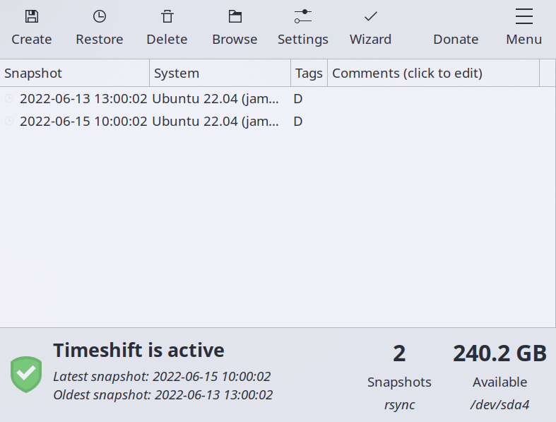

* TOC
{:toc}

# System Snapshots

## [Timeshift](https://teejeetech.com/timeshift/)

The developer's [Website](https://teejeetech.com/timeshift/) explains it all.
You can set it up to take periodic snapshots of your root, and home folder(optionally), and this will run automatically in the background, with no interruption.

## [Back in Time](https://backintime.readthedocs.io/en/latest/)

works in a similar fashion.

## [Rsnapshot](https://rsnapshot.org/)

works in a similar fashion.

## Rsync, tar

Set up either to make full system backups to another partition or another system on the network

However, backup scripts for each system are unique, and set-up might be tedious

# File System Checking

run `CHKDSK`(Microsot Windows) and `fsck`(GNU/Linux) periodically if not already running automatically on startup.

Enable `fsck` at boot time, it automatically repairs damaged portions of many filesystem types.

`man fsck`

`man fstab`

`man systemd-fsck`

# Synchronization

## Syncthing

discussed in the [Encryption](./encryption.md) guide [here](https://elvindesouza.github.io/hardening/encryption.html#password-sensitive-information-management-), Syncthing makes syncing folders across machines very easy. It is also cross-platform.

You can even sync entire partitions and disks between machines, but you will have difficulty syncing files that belong to other users(so not very usable to sync home and root directories)

Syncthing runs best when used only locally.

## [Rclone](https://rclone.org/)

from the website,

> Rclone is a command-line program to manage files on cloud storage. It is a feature-rich alternative to cloud vendors' web storage interfaces. Over 40 cloud storage products support rclone including S3 object stores, business & consumer file storage services, as well as standard transfer protocols.

## Git

You can use git to keep configuration files backed up on a service like GitHub or Gitlab. Learning basic git usage is necessary.

Refer to [the repository I use to manage my dotfiles across machines](https://github.com/elvindesouza/dotfiles)
