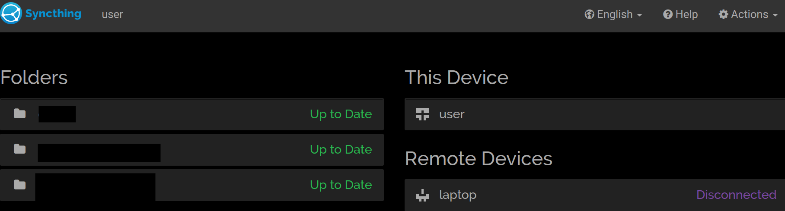

# Encryption

> In cryptography, encryption is the process of encoding information. This process converts the original representation of the information, known as plaintext, into an alternative form known as ciphertext.

## SED/Opal Specification

Hardware-based full-disk encryption on self-encrypting drives(SED)

Data is always encrypted with the data encryption key when stored to disk, even if there is no password set

data in use
data in motion (HTTPS only)
full system encryption
DNSSEC
gpg with commands
VNC x11vnc, tigervnc
OCSP
snort IPS
doker/flatpak/snap/appimage
VPN
NTPsec

### Partition Encryption-

Use LUKS(LVM additionally). Very easy to use, decrypting to non-technical users can just seem like "logging in to the computer"

### File Encryption-

**GnuPG**. Ideal for encrypting important documents, as these files are portable, and can have the same name as the original unencrypted file. Command line usage to encrypt and decrypt files is relatively straightforward.

Create a key with

`gpg --gen-key`

##### [interesting read for another day](https://www.philzimmermann.com/EN/essays/WhyIWrotePGP.html)

### Directory/Container Encryption-

**gocryptfs, eCryptfs or fscrypt**. Since they work on stacked filesystems(FUSE), this will unfortunately make it harder for non-technical users to unlock and navigate.
Ideal for encrypting archives of documents and downloaded files.

### Password, Sensitive Information Management-

**KeePassXC**. Portable, local, cross-platform, secure. You can keep this password database file (optionally) along with the encrypted files and containers synced across systems by running a `Syncthing` server. (consult [this](#setting-up-needed-services) section for best practices for setting up services)

> Consider the very real possibility of concurrent access corruption
